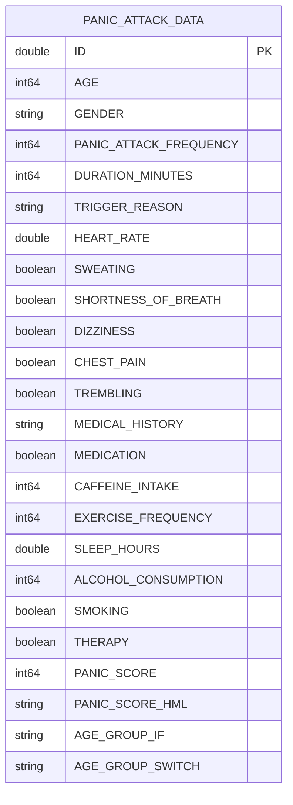

# Panic-Attack-Dashboard

# Panic Attacks Data Analysis — Semantic Model Documentation

> **Report file:** Panic Attacks Data Analysis_Snowflake.pbix
> **Last refreshed:** 25 July 2025
> **Compatibility level:** Power BI Desktop (localhost:50388)
> **Prepared by:** Power BI Modeling MCP Server

---

## Table of Contents

1. [Model Overview](#1-model-overview)
2. [Data Sources](#2-data-sources)
3. [Table Relationships](#3-table-relationships)
4. [Data Dictionary](#4-data-dictionary)
5. [Calculated Columns](#5-calculated-columns)
6. [Measures](#6-measures)
7. [Power Query Transformations](#7-power-query-transformations)
8. [Naming Conventions](#8-naming-conventions)

---

## 1. Model Overview

This semantic model supports analysis of panic attack patterns across a patient population. It draws from a single clinical dataset stored in Snowflake and exposes demographic, physiological, lifestyle, and outcome data for reporting and exploration in Power BI.

| Property | Value |
|---|---|
| Number of tables | 1 |
| Number of columns | 24 (21 source + 1 Power Query calculated + 2 DAX calculated) |
| Number of measures | 1 |
| Data source type | Snowflake |
| Source database | `POWERBIPROJECT` |
| Source schema | `PUBLIC` |
| Source table | `PANIC_ATTACK_DATA` |

---

## 2. Data Sources

### Snowflake Cloud Data Warehouse

The model connects to a Snowflake instance using the native Power BI Snowflake connector.

| Property | Value |
|---|---|
| Server | `qdpykak-zx14369.snowflakecomputing.com` |
| Warehouse | `compute_wh` |
| Database | `POWERBIPROJECT` |
| Schema | `PUBLIC` |
| Table | `PANIC_ATTACK_DATA` |
| Connector version | Implementation 2.0 |

The connection is established via Power Query M using the `Snowflake.Databases` function with the implementation set to `"2.0"` for enhanced compatibility and performance.

---

## 3. Table Relationships

This model currently contains a single fact table with no dimension tables or cross-table relationships. All analysis is performed within `PANIC_ATTACK_DATA`.



> **Note:** As the model grows, consider introducing a `DIM_PATIENT` table for demographic attributes (age, gender, medical history) and a separate `FACT_PANIC_EVENTS` table for episode-level metrics. This would enable cross-filtering and richer time-series analysis.

---

## 4. Data Dictionary

### Table: PANIC_ATTACK_DATA

This table contains one row per patient and captures demographic information, physiological symptoms, lifestyle factors, and an overall panic severity score.

#### Demographic Columns

| Column Name | Business Name | Data Type | Description |
|---|---|---|---|
| `ID` | Patient ID | Decimal | Unique identifier for each patient record. |
| `AGE` | Age | Integer | Age of the patient in years. |
| `GENDER` | Gender | Text | Self-reported gender of the patient. |

#### Panic Episode Metrics

| Column Name | Business Name | Data Type | Description |
|---|---|---|---|
| `PANIC_ATTACK_FREQUENCY` | Panic Attack Frequency | Integer | Number of panic attacks experienced within the reporting period. |
| `DURATION_MINUTES` | Attack Duration (Minutes) | Integer | Average duration of a panic attack episode, in minutes. |
| `TRIGGER_REASON` | Trigger Reason | Text | Reported cause or situation that triggered the panic attack (e.g., stress, social situation). |
| `PANIC_SCORE` | Panic Severity Score | Integer | Overall numeric severity score for the patient's panic condition. Higher values indicate greater severity. |
| `PANIC_SCORE_HML` | Panic Severity Band | Text | Categorises `PANIC_SCORE` into Low (< 4), Medium (4–8), or High (> 8). Derived in Power Query. |

#### Physiological Symptoms

| Column Name | Business Name | Data Type | Description |
|---|---|---|---|
| `HEART_RATE` | Heart Rate (BPM) | Decimal | Patient's recorded heart rate in beats per minute during or around a panic episode. |
| `SWEATING` | Sweating | Boolean | Indicates whether the patient reported excessive sweating as a symptom (True / False). |
| `SHORTNESS_OF_BREATH` | Shortness of Breath | Boolean | Indicates whether the patient reported difficulty breathing (True / False). |
| `DIZZINESS` | Dizziness | Boolean | Indicates whether the patient reported dizziness (True / False). |
| `CHEST_PAIN` | Chest Pain | Boolean | Indicates whether the patient reported chest pain or tightness (True / False). |
| `TREMBLING` | Trembling | Boolean | Indicates whether the patient reported shaking or trembling (True / False). |

#### Medical Background

| Column Name | Business Name | Data Type | Description |
|---|---|---|---|
| `MEDICAL_HISTORY` | Medical History | Text | Summary of pre-existing medical conditions relevant to the patient's mental health profile. |
| `MEDICATION` | On Medication | Boolean | Indicates whether the patient is currently prescribed medication for their condition (True / False). |
| `THERAPY` | In Therapy | Boolean | Indicates whether the patient is currently receiving psychological therapy or counselling (True / False). |

#### Lifestyle Factors

| Column Name | Business Name | Data Type | Description |
|---|---|---|---|
| `CAFFEINE_INTAKE` | Daily Caffeine Intake | Integer | Patient's average daily caffeine consumption (units not specified in source — assumed mg or cups). |
| `EXERCISE_FREQUENCY` | Weekly Exercise Frequency | Integer | Number of times per week the patient exercises. |
| `SLEEP_HOURS` | Average Sleep Hours | Decimal | Average number of hours of sleep per night. |
| `ALCOHOL_CONSUMPTION` | Alcohol Consumption | Integer | Patient's reported alcohol consumption level (units not specified in source). |
| `SMOKING` | Smoker | Boolean | Indicates whether the patient is a current smoker (True / False). |

---

## 5. Calculated Columns

These columns are defined using DAX and are computed at data refresh time, stored in the model.

> **Note:** Two implementations of the same age grouping logic exist (`AGE_GROUP_IF` and `AGE_GROUP_SWITCH`). Both produce identical results. It is recommended to retain only one — `AGE_GROUP_SWITCH` is preferred as it is more readable and maintainable — and deprecate the other.

---

### AGE_GROUP_IF

**Business name:** Age Group (IF version)
**Table:** PANIC_ATTACK_DATA
**Data type:** Text

**Business logic:** Assigns each patient to a demographic age band based on their age. The four bands are: Child (17 and under), Adolescent (18–24), Adult (25–64), and Senior (65 and above). Uses nested IF statements.

**DAX expression:**

```dax
AGE_GROUP_IF =
IF('PANIC_ATTACK_DATA'[AGE] <= 17, "Child",
    IF('PANIC_ATTACK_DATA'[AGE] <= 24, "Adoloscent",
        IF('PANIC_ATTACK_DATA'[AGE] <= 64, "Adult",
            "Senior"
        )
    )
)
```

> ⚠️ **Data quality note:** The value `"Adoloscent"` is a misspelling of "Adolescent". This should be corrected in whichever column is retained.

---

### AGE_GROUP_SWITCH

**Business name:** Age Group
**Table:** PANIC_ATTACK_DATA
**Data type:** Text

**Business logic:** Identical logic to `AGE_GROUP_IF` — assigns patients to Child, Adolescent, Adult, or Senior age bands — but implemented using the `SWITCH(TRUE(), ...)` pattern, which is more concise and easier to extend.

**DAX expression:**

```dax
AGE_GROUP_SWITCH =
SWITCH(TRUE(),
    'PANIC_ATTACK_DATA'[AGE] <= 17, "Child",
    'PANIC_ATTACK_DATA'[AGE] <= 24, "Adoloscent",
    'PANIC_ATTACK_DATA'[AGE] <= 64, "Adult",
    "Senior"
)
```

> ✅ **Recommended:** Retain this column as the canonical age group, rename it to `AGE_GROUP`, fix the misspelling, and delete `AGE_GROUP_IF`.

**Age band reference:**

| Band | Age Range |
|---|---|
| Child | 0–17 |
| Adolescent | 18–24 |
| Adult | 25–64 |
| Senior | 65+ |

---

## 6. Measures

### PCT_PATIENTS_DIZZINESS

**Business name:** % of Patients Reporting Dizziness
**Table:** PANIC_ATTACK_DATA
**Format:** General number (percentage — multiply by 100 built into formula)

**Business logic:** Calculates the percentage of patients in the current filter context who reported dizziness as a symptom. The result is expressed as a value between 0 and 100 (e.g., 42.5 means 42.5%). If the table contains no rows, the measure returns 0 to avoid divide-by-zero errors.

This measure is useful for understanding how prevalent dizziness is as a symptom across different segments — for example, comparing dizziness rates by gender, age group, trigger reason, or panic severity band.

**DAX expression:**

```dax
PCT_PATIENTS_DIZZINESS =
DIVIDE(
    COUNTROWS(FILTER('PANIC_ATTACK_DATA', 'PANIC_ATTACK_DATA'[DIZZINESS] = TRUE())),
    COUNTROWS('PANIC_ATTACK_DATA'),
    0
) * 100
```

**Component breakdown:**

| Component | Purpose |
|---|---|
| `FILTER(..., DIZZINESS = TRUE())` | Selects only rows where dizziness was reported |
| `COUNTROWS(FILTER(...))` | Counts those patients |
| `COUNTROWS('PANIC_ATTACK_DATA')` | Counts total patients in the current context |
| `DIVIDE(..., ..., 0)` | Safe division — returns 0 if denominator is zero |
| `* 100` | Converts the ratio to a percentage value |

---

## 7. Power Query Transformations

The following transformations are applied in Power Query before data is loaded into the model.

### Step-by-step transformation log

| Step | Name | Description |
|---|---|---|
| 1 | `Source` | Connects to the Snowflake instance at `qdpykak-zx14369.snowflakecomputing.com` using the `compute_wh` warehouse. |
| 2 | `POWERBIPROJECT_Database` | Navigates to the `POWERBIPROJECT` database within Snowflake. |
| 3 | `PUBLIC_Schema` | Navigates into the `PUBLIC` schema. |
| 4 | `PANIC_ATTACK_DATA_Table` | Selects the `PANIC_ATTACK_DATA` source table. |
| 5 | `Changed Type` | Explicitly casts eight columns to their correct data types to ensure accurate calculations downstream (see type cast table below). |
| 6 | `Added Conditional Column` | Creates `PANIC_SCORE_HML` — a text band derived from `PANIC_SCORE` using conditional logic: Low (< 4), Medium (4–8), High (> 8). |
| 7 | `Subtracted from Column` | Subtracts 1 from all values in the `HEART_RATE` column. |

### Type casts applied (Step 5)

| Column | Cast to type |
|---|---|
| `AGE` | Int64 |
| `PANIC_ATTACK_FREQUENCY` | Int64 |
| `DURATION_MINUTES` | Int64 |
| `HEART_RATE` | Number (Decimal) |
| `CAFFEINE_INTAKE` | Int64 |
| `EXERCISE_FREQUENCY` | Int64 |
| `ALCOHOL_CONSUMPTION` | Int64 |
| `PANIC_SCORE` | Int64 |

### Notes and recommendations

> ⚠️ **Heart Rate adjustment (Step 7):** The `HEART_RATE` column has 1 subtracted from every value as a Power Query step. This is an unusual transformation with no documented reason in the model. This should be reviewed and either documented with a justification or removed if it was applied in error. Unexplained numeric adjustments to clinical measurements are a data quality risk.

> ℹ️ **PANIC_SCORE_HML:** This column (`PANIC_SCORE_HML`) is created in Power Query as a computed column. Note that there is also a column called `PANIC_SCORE_HML` that was renamed from `PANIC SCORE (HML)` — these refer to the same column. The conditional logic used is: `< 4 = Low`, `> 8 = High`, `else = Medium`. Note the trailing space in the original `"High "` value — this should be trimmed.

---

## 8. Naming Conventions

All model objects follow `UPPER_SNAKE_CASE` as the standard naming convention. The following rules apply:

| Object type | Convention | Example |
|---|---|---|
| Tables | UPPER_SNAKE_CASE | `PANIC_ATTACK_DATA` |
| Source columns | UPPER_SNAKE_CASE | `PANIC_ATTACK_FREQUENCY` |
| Power Query columns | UPPER_SNAKE_CASE | `PANIC_SCORE_HML` |
| Calculated columns | UPPER_SNAKE_CASE | `AGE_GROUP_SWITCH` |
| Measures | UPPER_SNAKE_CASE with `PCT_` prefix for percentages | `PCT_PATIENTS_DIZZINESS` |

### Outstanding recommendations

| Priority | Item | Action |
|---|---|---|
| High | `HEART_RATE` adjustment | Investigate and document or remove the `-1` Power Query step |
| High | Duplicate age group columns | Delete `AGE_GROUP_IF`, rename `AGE_GROUP_SWITCH` to `AGE_GROUP` |
| Medium | Misspelling in age group values | Fix `"Adoloscent"` → `"Adolescent"` in the retained column |
| Medium | Trailing space in `PANIC_SCORE_HML` | Fix `"High "` → `"High"` in Power Query |
| Low | Add measure descriptions | Add DAX `description` metadata to `PCT_PATIENTS_DIZZINESS` |
| Low | Expand measure library | Consider adding measures for other symptom prevalence rates (sweating, chest pain, etc.) using the same pattern as `PCT_PATIENTS_DIZZINESS` |

---

*Documentation generated on 26 March 2026 via Power BI Modeling MCP Server.*
